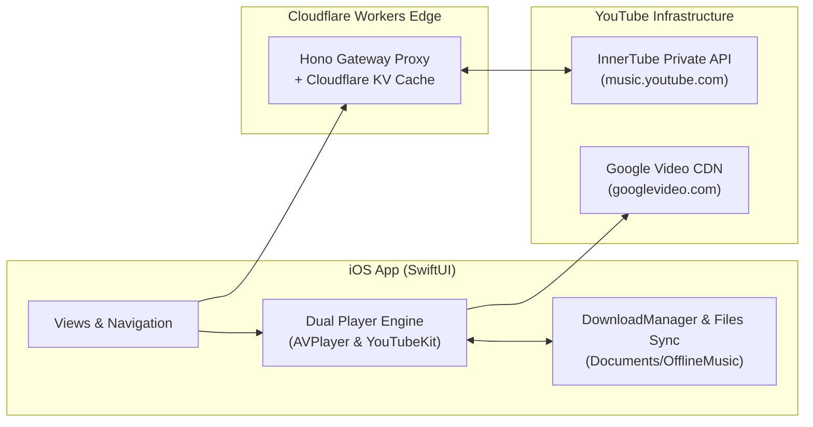

# TuneTube Architecture

The complete, illustrated architecture documentation with interactive Mermaid diagrams, playback state machines, DASH fMP4 patching diagrams, and two-way file synchronization flows has been moved to:

👉 **[docs/ARCHITECTURE.md](docs/ARCHITECTURE.md)**

---

## Quick Visual Architecture Map

For full details, please refer to [docs/ARCHITECTURE.md](docs/ARCHITECTURE.md).
