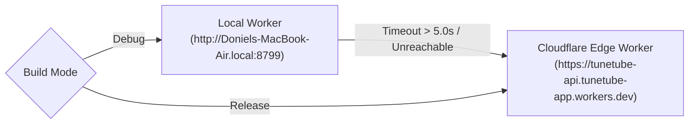

# TuneTube Developer Guide

A practical guide for building, running, debugging, and contributing to the **TuneTube** codebase.

---

## 1. Prerequisites & Environment Setup

| Tool | Version Requirement | Purpose |
| :--- | :--- | :--- |
| **macOS** | macOS Sonoma (14.0+) or macOS Sequoia (15.0+) | Required for Xcode and iOS Simulator |
| **Xcode** | Xcode 15.0+ (iOS 17.0+ SDK) | Native app compiler |
| **XcodeGen** | Latest (`brew install xcodegen`) | Generates `TuneTube.xcodeproj` from `project.yml` |
| **Node.js & npm** | Node.js v18.0+ / npm v9.0+ | Cloudflare Worker development |
| **Wrangler** | Latest (`npm install -g wrangler` or `npx wrangler`) | Cloudflare Workers CLI |

---

## 2. Quick Start: Running the Project

### Step 1: Start the Local Cloudflare Worker
The backend proxy translates requests to YouTube Music's InnerTube API. For local development on Mac / Wi-Fi:

```bash
cd server
npm install
npx wrangler dev --ip 0.0.0.0 --port 8799
```

> [!IMPORTANT]
> The `--ip 0.0.0.0` argument is critical. It allows physical iPhones and Simulator instances on your local network to reach your Mac's development server (`http://Doniels-MacBook-Air.local:8799`).

### Step 2: Generate the Xcode Project
XcodeGen manages the project definition in `project.yml`:

```bash
# From the repository root
xcodegen generate
open TuneTube.xcodeproj
```

### Step 3: Build and Run
Select the `TuneTube` scheme and your target device (e.g. `iPhone 17 Pro` Simulator) and press **⌘R**.

Alternatively, build from the command line:
```bash
xcodebuild -project TuneTube.xcodeproj -scheme TuneTube -destination 'platform=iOS Simulator,name=iPhone 17 Pro' build
```

---

## 3. Network Configuration & Fallback Mechanism

TuneTube automatically manages API environments between Debug and Release builds in `TuneTube/Core/AppConfig.swift` and `project.yml`:



- **Debug Builds**:
  - Tries your local Mac Worker first.
  - If you are outside your home network or the local Worker isn't running, `APIClient` triggers a **5.0-second timeout** and automatically switches to the production Cloudflare Worker so your app never hangs on a white/skeleton screen.
- **Release Builds**:
  - Points directly to the production Cloudflare Worker without any local network checks.

---

## 4. Playback Architecture & Audio Engines

TuneTube operates a **Dual-Engine Player** managed by `PlayerEngine.swift`:

1. **Song Mode (`isNativeAVPlayer = true`)**:
   - Streams native high-bitrate AAC audio (`itag 140` / `itag 139`) via Apple `AVPlayer`.
   - Complete background and Lock Screen audio with album art.
   - Initialized instantly (<200ms) and caches the full track in the background.
2. **Video Mode (`isNativeAVPlayer = false`)**:
   - Plays the official YouTube embed via `YouTubePlayerKit` in a `WKWebView`.
   - Intact YouTube video branding, ads, and video controls.
3. **Offline Playback**:
   - `DownloadManager.shared.localAudioURL(for: item.id)` supplies the local `file://` URL.
   - Bypasses all network requests, stream extractions, and YouTube web iframes.

### Critical Audio Gotcha: Fragmented MP4 (fMP4) 2x Duration
YouTube DASH audio streams contain duplicate duration headers in the `moov` box and movie fragments. Without patching, `AVPlayer` will report double duration and stall at 50%.
- **Rule**: Always run `StreamResolver.sanitizeFragmentedMP4(at: fileURL)` whenever downloading or saving an AAC audio file before handing it to `AVPlayer`.

---

## 5. Offline Music & Apple Files App Sharing

Offline downloads reside in `Documents/OfflineMusic/`:
- `audio/`: AAC `.m4a` files or imported audio files (`.mp3`, `.flac`, `.wav`, etc.).
- `artwork/`: Album cover images (`.jpg`).
- `metadata.json`: Download registry.

### Files App Sharing
Enabled in `Info.plist` via `UIFileSharingEnabled = true` and `LSSupportsOpeningDocumentsInPlace = true`.
- **Finding Files in Simulator**:
  Open the **Files app** in iOS Simulator -> **On My iPhone** -> **TuneTube**.
- **Two-Way Synchronization**:
  - If a file is deleted in Files: TuneTube's background `syncWithDisk()` automatically removes it from the "Downloaded" library.
  - If a user drops songs into the folder: TuneTube scans and extracts ID3 tags and album art via `AVURLAsset` and automatically lists them in the library.

---

## 6. Debugging Tools & Diagnostics

### In-App Debugger (`DebugSwift`)
In Debug builds, a floating ball overlay appears on screen:
- Tap to inspect real-time HTTP traffic, memory usage, CPU load, and FPS.
- View Keychain entries and `UserDefaults` live on device.

### Network Logging (`NetworkLogger`)
All API calls are logged with request headers, masked auth tokens, elapsed times, and response status codes (`🟢 200`, `🔴 4xx/5xx`).

### Unified System Logging (`os.Logger`)
Filter logs in Console.app or Xcode Console using:
```text
subsystem:com.tunetube
```
Categories:
- `DebugLog.network`
- `DebugLog.player`
- `DebugLog.store`
- `DebugLog.auth`

---

## 7. Testing & Quality Assurance

### 1. Server Fixture & Parser Tests
Run the server test suite against real YouTube Music fixtures:
```bash
cd server
npx vitest run
```

To refresh InnerTube fixtures:
```bash
node server/test/capture-fixtures.mjs
```

### 2. Client Build Test
Verify clean compilation:
```bash
xcodebuild -project TuneTube.xcodeproj -scheme TuneTube -destination 'platform=iOS Simulator,name=iPhone 17 Pro' build
```

### 3. CodeRabbit AI Reviews
This repository integrates [CodeRabbit](https://coderabbit.ai) for automated code quality and PR reviews.
- See [`AGENTS.md`](AGENTS.md) for the mandatory AI assistant directive.
- Whenever preparing a branch or PR, always prompt the developer for a CodeRabbit review before merging.
