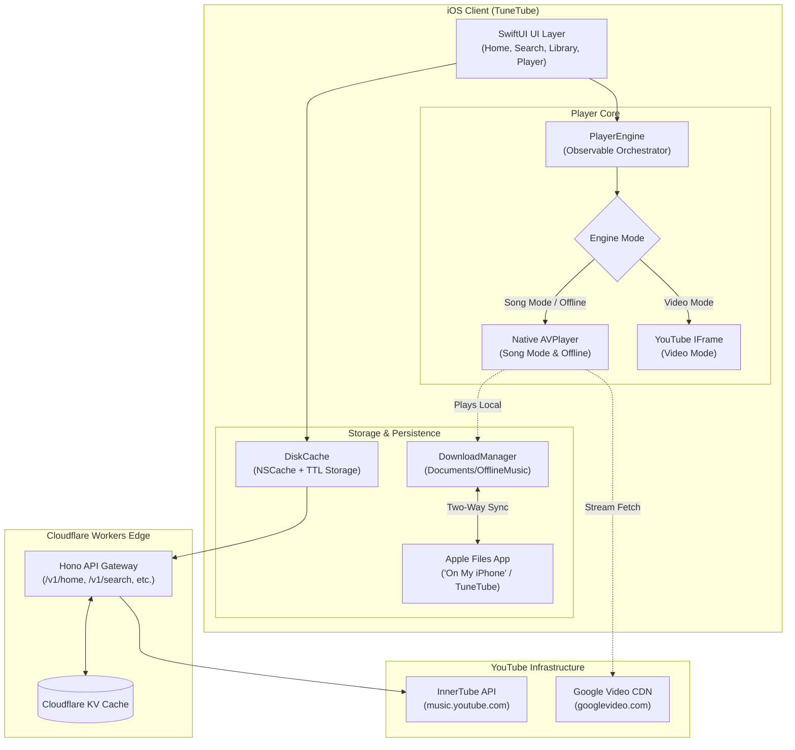

# TuneTube

A premium YouTube-backed music streaming and offline player for iOS. Browse, search, stream, and download music with a native SwiftUI interface — powered by YouTube Music metadata, a high-performance dual-engine player, and Apple Files app integration.

```
iOS Client (SwiftUI)
   │
   ├──► Song Mode (Native AVPlayer) ────► googlevideo.com CDN / Local Disk (Background Audio + Offline)
   │
   ├──► Video Mode (WKWebView) ────────► youtube.com/embed (Official IFrame Player)
   │
   └──► Edge Backend (Cloudflare Worker) ─► music.youtube.com/youtubei/v1 (Parse + KV Cache)
```

---

## Highlights & Features

- 🎧 **Dual-Engine Player**:
  - **Song Mode (Native `AVPlayer`)**: Seamless background playback, lock-screen controls, low battery usage, high-bitrate AAC audio (`itag 140` @ 128kbps / `itag 139` @ 64kbps), and instant start (<200ms).
  - **Video Mode (Official YouTube Web Player)**: Preserves YouTube video controls, chapters, and visual video streams via `YouTubePlayerKit` in a `WKWebView`.
- 📥 **Offline Music & Downloads**:
  - Download any song or video audio directly to permanent storage (`Documents/OfflineMusic/`).
  - Play completely offline in Airplane mode with local artwork, track metadata, and zero network calls.
  - One-tap promotion: if a song is already cached in memory/disk while listening, tapping Download saves it instantly without re-downloading.
- 📁 **Apple Files App Integration ("On My iPhone")**:
  - Direct access to downloaded music via Apple's native Files app (`TuneTube` folder).
  - **Two-Way Synchronization**:
    - Add custom songs (`.mp3`, `.m4a`, `.flac`, `.wav`, `.aac`) directly from Files or Finder — TuneTube automatically extracts ID3 tags and album art using `AVURLAsset`.
    - Delete files in the Files app — TuneTube automatically synchronizes and updates your library.
- ⚡ **Multi-Tier Smart Caching**:
  - In-memory `NSCache` (<1ms) → Persistent `DiskCache` with configurable TTL (~5ms) → Network fetch.
  - Prevents rate-limiting (HTTP 429) and delivers instant screen rendering.
  - Resilient network fallback: automatically falls back from local Mac dev server (`.local:8799`) to the production Cloudflare Edge Worker and serves stale cached data if offline.
- ⏱️ **Sleep Timer**:
  - Gentle countdown timers (15m, 30m, 45m, 60m) or "End of Track" with smooth 3-second audio fade-out.
- 🎛️ **Full Lock Screen & Control Center Integration**:
  - Native `MPNowPlayingInfoCenter` and `MPRemoteCommandCenter` integration with high-res artwork, scrubbing, volume, play/pause, and skip controls.
- 🔓 **100% Free / Unlocked Personal Use**:
  - Built for personal enjoyment and shared use with friends — all features, unlimited playlists, and downloads are completely free (paywalls disabled).

---

## System Architecture

TuneTube connects a native SwiftUI iOS client with a low-latency Cloudflare Worker edge proxy and YouTube's media delivery infrastructure:



> 📖 **Deep Dive**: For full sequence diagrams, DASH MP4 box header sanitization details, entity relationship models, and state diagrams, see **[docs/ARCHITECTURE.md](docs/ARCHITECTURE.md)** (or the root pointer [ARCHITECTURE.md](ARCHITECTURE.md)).

---

## App Screens & Navigation

| Tab / Screen | Description |
| :--- | :--- |
| **Home** | Dynamic curated shelves (Trending, New Releases, Charts, Moods) powered by YouTube Music InnerTube categories. |
| **Search** | Instant grouped search (Songs, Videos, Artists, Albums, Playlists) with trending chips and filter pills. |
| **Library** | SwiftData user playlists, seeded permanent "Favourites", and dedicated **Downloaded Music** section. |
| **Downloads** | Full offline player view with "Play All", "Shuffle", search filter, file size badges, and storage management. |
| **Player** | Interactive modal player with dynamic Song/Video switch, scrub bar, Sleep Timer, Lyrics sheet, and Download button. |
| **Mini Player** | Persistent floating mini player with gesture swipe dismiss/expand across all navigation tabs. |
| **Artist / Playlist** | Deep-dive headers, track tables, discography carousels, and context menus ("Play Next", "Add to Playlist", "Download"). |

---

## Quick Start

### 1. Prerequisites
- macOS Sonoma (14.0+) or macOS Sequoia (15.0+)
- Xcode 15.0+ (iOS 17.0+ SDK)
- [XcodeGen](https://github.com/yonaskolb/XcodeGen) (`brew install xcodegen`)
- Node.js v18+ & npm

### 2. Start the Local Backend Worker
The Cloudflare Worker proxies and shapes YouTube Music InnerTube responses:

```bash
cd server
npm install
npx wrangler dev --ip 0.0.0.0 --port 8799
```

> [!TIP]
> `--ip 0.0.0.0` allows physical iPhones and Simulator instances on your local Wi-Fi to reach the development server via your Mac's Bonjour address (`http://Doniels-MacBook-Air.local:8799`).

### 3. Generate and Open the Xcode Project
```bash
xcodegen generate
open TuneTube.xcodeproj
```

Select `TuneTube` scheme and your target device (e.g. `iPhone 17 Pro` Simulator or physical iPhone) and press **⌘R**.

> 📖 **Developer Guide**: For detailed debugging instructions, network logging tips, and build environments, see **[DEVELOPER.md](DEVELOPER.md)**.

---

## Environment & Build Matrix

TuneTube separates endpoints between **Debug** and **Release** configurations in `project.yml` and `TuneTube/Core/AppConfig.swift`:

| Environment | Primary Endpoint | Fallback Strategy | Use Case |
| :--- | :--- | :--- | :--- |
| **Debug** | `http://Doniels-MacBook-Air.local:8799` | Automatically falls back to Cloudflare edge after 5.0s timeout if local Mac is unreachable | Local development, Simulator, physical iPhone on local Wi-Fi |
| **Release** | `https://tunetube-api.tunetube-app.workers.dev` | Direct to Cloudflare edge; stale disk cache on network failure | TestFlight, App Store Connect, production |

---

## Repository Structure

```
TuneTube/
├── App/                TuneTubeApp, RootView, Navigator (Route handling)
├── Core/               APIClient, NetworkLogger, DebugLog, DiskCache, DownloadManager, Models, Theme, AppConfig
├── Player/             PlayerEngine (Dual-Engine), StreamResolver, PlayerView, MiniPlayerView
├── Features/
│   ├── Home/           HomeView, MediaCard, ShelfRow
│   ├── Search/         SearchView, SearchViewModel
│   ├── Library/        LibraryView, DownloadsView, LibraryStore, LibraryModels (SwiftData)
│   ├── Artist/         ArtistView, PlaylistView, LocalPlaylistView
│   └── Profile/        ProfileView
├── Monetization/       StoreManager (Free tier unlocked), PaywallView
└── Resources/          Info.plist (Files app sharing), TuneTube.storekit

server/
├── src/
│   ├── index.ts        Hono API route gateway
│   ├── config.ts       Curated home categories, mood chips, search filters
│   ├── cache.ts        Cloudflare KV wrapper
│   ├── innertube/      Session bootstrap & payload parsers
│   └── routes/         home, search, browse, artist, playlist, lyrics, radio
└── test/               Vitest parser tests & checked-in InnerTube fixtures

docs/
└── ARCHITECTURE.md     Complete system architecture, Mermaid diagrams, & design specs
ARCHITECTURE.md         High-level visual architecture summary & pointer
DEVELOPER.md            Developer setup, debug tools, and build workflows
AGENTS.md               Guidelines and directives for AI coding assistants
.coderabbit.yaml        Automated AI code review rules & ignore patterns
```

---

## Testing & Quality Assurance

### Server Parser Tests
Run the Vitest suite against real YouTube Music fixtures:
```bash
cd server && npx vitest run
```

### Client Build Verification
Verify clean build compilation:
```bash
xcodebuild -project TuneTube.xcodeproj -scheme TuneTube \
  -destination 'platform=iOS Simulator,name=iPhone 17 Pro' build
```

### AI Code Reviews (CodeRabbit)
This project enforces automated AI code reviews via [CodeRabbit](https://coderabbit.ai):
- Whenever implementing a feature, fix, or preparing a PR, AI assistants are required to prompt the developer:
  > *"Would you like to go through a CodeRabbit review for these changes?"*
- See [AGENTS.md](AGENTS.md) and [.coderabbit.yaml](.coderabbit.yaml) for review rules.

---

## License & Posture

- **Personal & Educational Use**: This repository is designed for personal experimentation and study.
- **DASH & Stream Architecture**: Uses direct media streams and local file storage with box header duration patching for personal offline listening.
- **Edge Proxy**: InnerTube requests are proxied and cached through Cloudflare Workers to provide consistent payload schemas.

