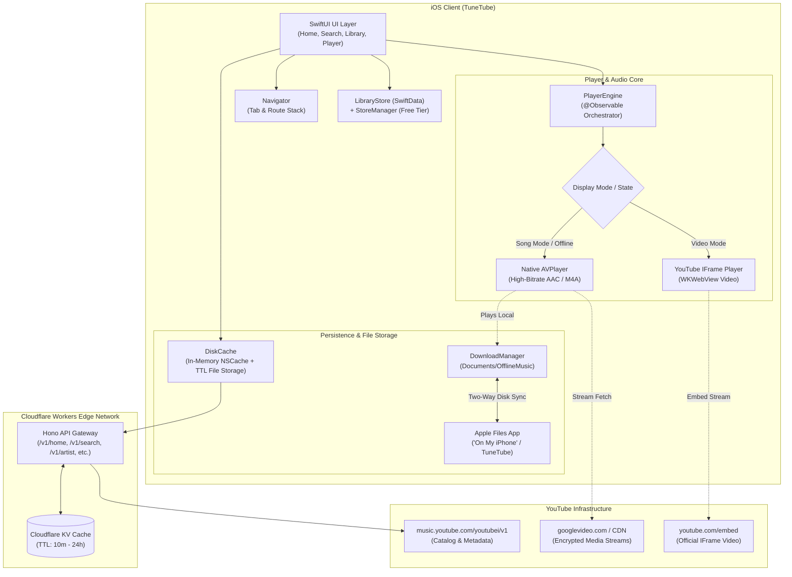
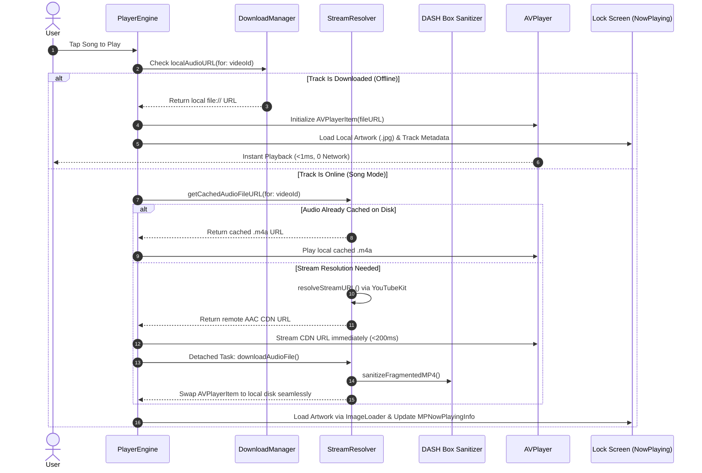
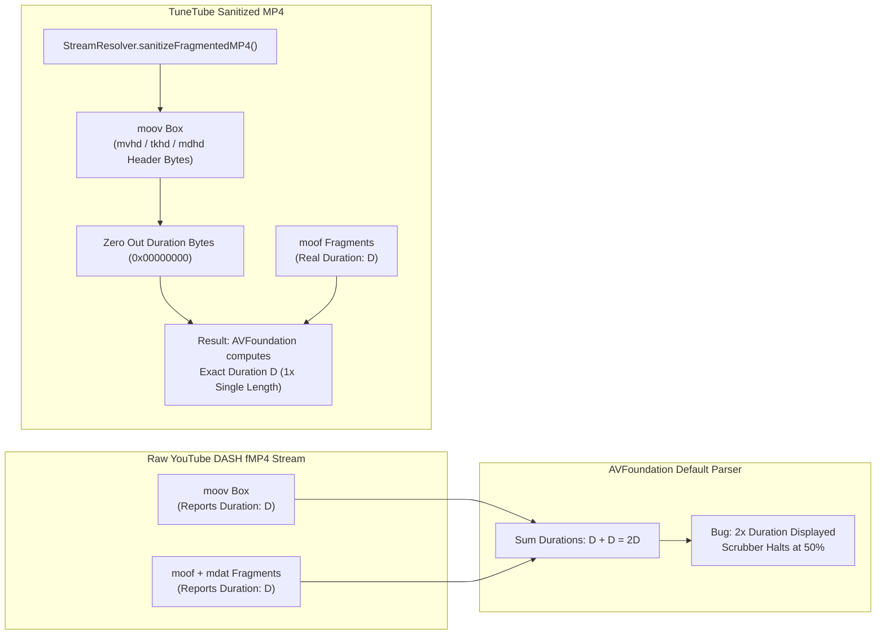
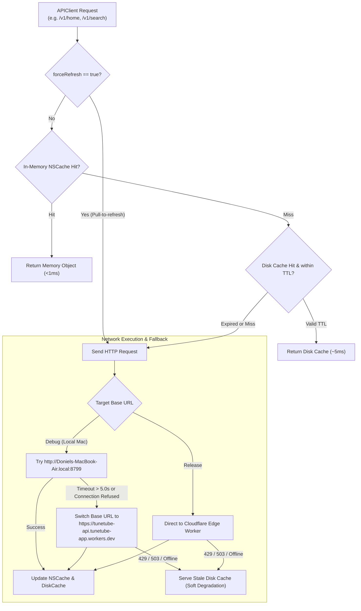
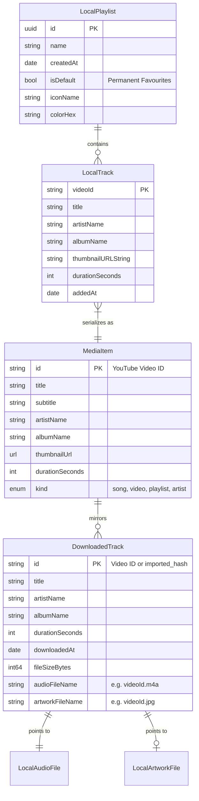
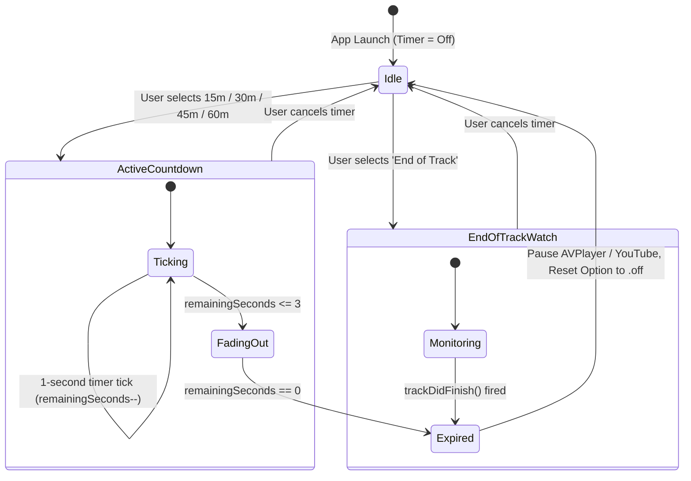

# TuneTube Architecture and System Design

A comprehensive technical reference for the architecture, playback pipelines, offline storage, caching layers, and design decisions in **TuneTube**.

---

## 1. System Architecture Overview

TuneTube uses a decoupled, privacy-respecting client-server architecture:
- **iOS Client (`TuneTube/`)**: Native SwiftUI application (iOS 17+) running a dual-engine player (`AVFoundation` for pure audio, `YouTubePlayerKit` for official video) with SwiftData and local file persistence.
- **Edge Backend (`server/`)**: Cloudflare Worker proxying YouTube Music's InnerTube API with global Cloudflare KV caching.



---

## 2. Playback Architecture: The Dual-Engine Pipeline

TuneTube solves the historic YouTube background-audio restriction through an intelligent **Dual-Engine Architecture**:

1. **Song Mode (Default)**: Uses native Apple `AVPlayer` streaming high-bitrate AAC (`itag 140` @ 128kbps or `itag 139` @ 64kbps). Buffers in <200ms, consumes minimal battery, provides continuous lock-screen audio, and supports native system scrubbers and volume controls.
2. **Video Mode**: Renders the official YouTube web player inside a `WKWebView` with official branding, chapters, and video controls.
3. **Offline Mode**: Native `AVPlayer` streaming directly from local `file://` URLs with zero network activity.



---

## 3. DASH Audio Fragmentation & Header Sanitization

YouTube DASH audio streams (itags 140 and 139) are packaged as **Fragmented MP4 (fMP4)**. In these streams:
- The initial Movie Box (`moov`) defines a duration $D$.
- The subsequent Movie Fragment Boxes (`moof` + `mdat`) contain audio chunks totaling duration $D$.

Without correction, Apple's `AVFoundation` engine parses both the `moov` header duration and sums all fragment durations, reporting **$2 \times D$** (e.g. `9:22` instead of `4:41`). This causes progress bars to halt at 50% and track auto-advance to break.



### Binary Box Header Patch Offsets
`StreamResolver.sanitizeFragmentedMP4(at:)` directly inspects the binary MP4 box headers and zeros out the initial movie duration fields:

| MP4 Box | Version 0 Offset | Version 1 Offset | Zero Length |
| :--- | :--- | :--- | :--- |
| **`mvhd`** (Movie Header) | `offset + 16` | `offset + 24` | 4 bytes (v0) / 8 bytes (v1) |
| **`tkhd`** (Track Header) | `offset + 20` | `offset + 28` | 4 bytes (v0) / 8 bytes (v1) |
| **`mdhd`** (Media Header) | `offset + 16` | `offset + 24` | 4 bytes (v0) / 8 bytes (v1) |

---

## 4. Offline Storage & Files App Two-Way Synchronization

Downloaded media lives in `Documents/OfflineMusic/`, making it visible to the user and resilient to operating system cache purges.

```mermaid
flowchart TD
    subgraph Filesystem ["Documents/OfflineMusic/ (isExcludedFromBackup = true)"]
        AudioDir["audio/\n<videoId>.m4a / <fileName>.mp3"]
        ArtDir["artwork/\n<videoId>.jpg"]
        MetaFile["metadata.json\n[DownloadedTrack Registry]"]
    end

    subgraph SyncEngine ["DownloadManager (Two-Way Sync Engine)"]
        direction TB
        Trigger["Triggers: App Foreground\nor DownloadsView.onAppear"]
        WorkerTask["Task.detached(priority: .utility)"]
        
        Trigger --> WorkerTask
        
        subgraph Detection ["Non-Blocking File Reconciler"]
            Scan1["1. File Deletion Check:\nFilter tracks where file exists"]
            Scan2["2. New File Discovery:\nDetect .m4a, .mp3, .flac, .wav, .aac"]
            TagExtract["3. AVURLAsset Extraction:\nRead Title, Artist, Album, Artwork"]
        end
        
        WorkerTask --> Scan1
        WorkerTask --> Scan2
        Scan2 --> TagExtract
    end

    subgraph AppleFilesApp ["Apple iOS Files App ('On My iPhone')"]
        UIFiles["TuneTube Folder\n(UIFileSharingEnabled = true)"]
        UserAction["User drops MP3/FLAC\nor deletes unwanted track"]
    end

    subgraph AppUI ["TuneTube Library UI"]
        DLView["DownloadsView\n(Play All, Shuffle, Filter, File Sizes)"]
    end

    Filesystem <--> UIFiles
    UserAction --> UIFiles
    Filesystem --> SyncEngine
    Detection --> MetaFile
    SyncEngine -->|@MainActor Update| DLView
```

### Storage Characteristics

| Attribute | Temporary Cache (`Caches/AudioTracks`) | Permanent Downloads (`Documents/OfflineMusic`) |
| :--- | :--- | :--- |
| **Directory** | `Library/Caches/AudioTracks/` | `Documents/OfflineMusic/` |
| **Purgeable by iOS** | Yes (purged during storage pressure) | **No** (`isExcludedFromBackup = true`) |
| **Cap Limit** | FIFO queue capped at 50 tracks | **Unlimited** (bounded only by device flash) |
| **Files App Access** | Hidden | **Visible & Editable** under *On My iPhone* |
| **Artwork Format** | Memory / Transient Cache | Persistent JPEG (`artwork/<id>.jpg`) |

---

## 5. Network Architecture: Cache-First Strategy & Fallback Matrix

To prevent rate-limiting (HTTP 429) from edge gateways and provide instant screen transitions, `APIClient` and `DiskCache` operate a tiered cache:



### Cache TTL Windows

| Data Type | Cache TTL | Stale Fallback on Error | Force Refresh Option |
| :--- | :--- | :--- | :--- |
| **Home Shelves** (`/v1/home`) | 1 hour | Yes | Yes (Pull-to-refresh) |
| **Search Queries** (`/v1/search`) | 15 minutes | Yes (`search-last-loaded`) | Yes |
| **Artist Details** (`/v1/artist`) | 24 hours | Yes | Yes |
| **Playlists / Categories** | 6 hours | Yes | Yes |
| **Remote Config** (`/v1/config`) | 1 hour | Yes (Hardcoded defaults) | Yes |

---

## 6. Entity Relationship Model



---

## 7. Sleep Timer State Machine

The Sleep Timer in `PlayerEngine` runs a precise 1-second countdown task with automatic audio fade and shutdown:



---

## 8. Verification & Test Matrix

All architectural layers are covered by automated test suites and compiler verifications:

1. **InnerTube Payload Parsers**: Tested against checked-in YouTube Music JSON payloads (`server/test/`) using Vitest:
   ```bash
   cd server && npx vitest run
   ```
2. **Swift Client Build Integrity**: Verified using `xcodebuild` targeting iOS 17+ Simulator and physical devices:
   ```bash
   xcodebuild -project TuneTube.xcodeproj -scheme TuneTube -destination 'platform=iOS Simulator,name=iPhone 17 Pro' build
   ```
3. **Continuous Code Quality**: Verified via [CodeRabbit](https://coderabbit.ai) integration on all pull requests adhering to [`.coderabbit.yaml`](../.coderabbit.yaml).
